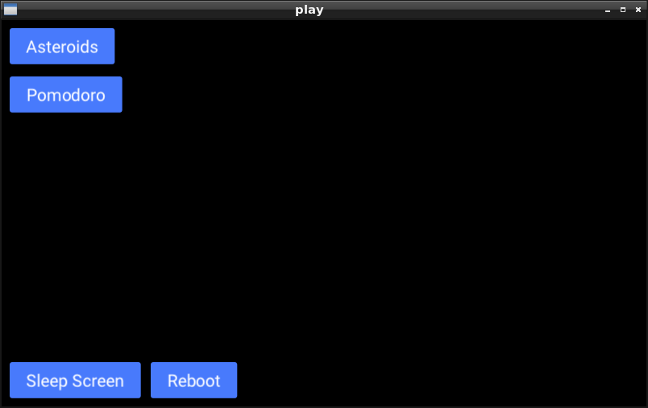

Top-level apps that runs multiple scenic apps underneath them using a launcher application written in Scenic.

Check the following directories for detailed instructions on running the projects:
* `ui/` - Run via scenic on the desktop
* `fw/` - Run on a Nerves device with a touchscreen
  * Official Raspberry PI touch screen is supported

TODO:
- [x] Integrate https://github.com/smartrent/ramoops_logger
- [ ] Create a "ScreenSaver". Can use this as a pattern
  - https://github.com/jjcarstens/hub/blob/master/atm/lib/atm/session.ex#L74
- [ ] Create a scenic log viewer app to view RingLogger logs or similar
