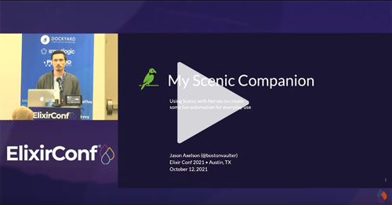

Top-level app that runs multiple scenic apps underneath. Uses a launcher application written in Scenic.

Main Dashboard:

Check the following directories for detailed instructions on running the projects:
* `ui/` - Run via scenic on the desktop
* `fw/` - Run on a Nerves device with a touchscreen
  * Official Raspberry PI touch screen is supported

I spoke about this project a ElixirConf 2021, watch the video on YouTube:

Sub-application Repos:
- https://github.com/axelson/piano_ex
- https://github.com/axelson/pomodoro
- https://github.com/axelson/govee
- https://github.com/axelson/govee_phx
- https://github.com/axelson/govee_semaphore
- https://github.com/axelson/scenic_launcher
- https://github.com/axelson/scenic_asteroids
